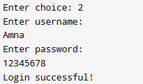

# CodeAlpha_Login_and_Registration_System

## Description

This project is a beginner-friendly C++ console application developed as part of the **CodeAlpha C++ Programming Internship**. It allows users to register a new account and log in using a username and password. The project demonstrates the use of file handling, functions, loops, conditional statements, and user input validation.

---

## Features

- User Registration
- User Login Authentication
- File Handling for Storing User Data
- Menu-Driven Interface
- Input Validation
- Simple and Easy-to-Use Console Application

---

## Technologies Used

- C++
- File Handling
- Functions
- Loops
- Conditional Statements

---

## Screenshots

### Registration Screen

### Login Screen

### Program Running

### Program Output

---

## How to Run

1. Compile the `Login_and_Registration_System.cpp` file using any C++ compiler.
2. Run the generated executable.
3. Choose one of the available options:
   - Register a new account
   - Log in with existing credentials
4. Follow the on-screen instructions.

---

## Learning Outcomes

This project helped me understand:

- Functions in C++
- File handling (`fstream`)
- User authentication logic
- Conditional statements
- Loops
- Basic console application development

---

## Author

**Amna Affaf**

GitHub: https://github.com/amnaaffaf3-coder
